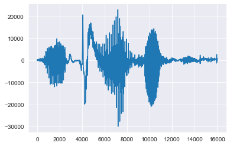
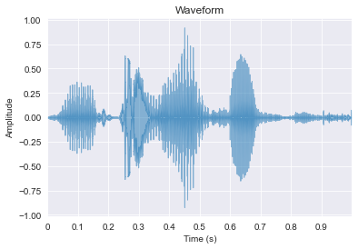
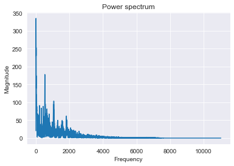
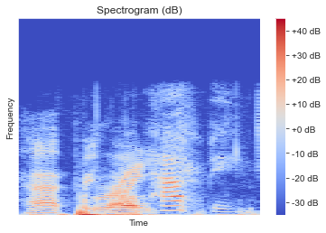

- 음성을 시각화 하는 방법을 알아보겠습니다. torch를 사용해서도 시각화가 가는하지만 python에는 음성데이터 처리에 강력한 librosa가 있습니다


```python
import os
import pandas as pd
import numpy as np
import seaborn as sns
import matplotlib.pyplot as plt

from scipy.io import wavfile
from glob import glob
from tqdm import tqdm

%matplotlib inline

sns.set_style('darkgrid')
```


```python
def data_loader(files):
    out = []
    for file in tqdm(files):
        fs, data = wavfile.read(file)
        out.append(data)    
    out = np.array(out)
    return out
```


```python
%%time

# 데이터 불러오기
x_data = glob('./rsc/train/*.wav')
x_data = data_loader(x_data)
```

    100%|█████████▉| 99975/100000 [01:20<00:00, 1300.65it/s]


```python
%%time

fs, data = wavfile.read('./rsc/train/train_00303.wav')
data = np.array(data)
```

    CPU times: user 935 µs, sys: 1.81 ms, total: 2.74 ms
    Wall time: 2.74 ms


```python
plt.plot(data)
```


    [<matplotlib.lines.Line2D at 0x105a35410>]



```python
!sudo pip install numba==0.43.0
!sudo pip install llvmlite==0.32.1
!sudo pip install librosa
```


```python
import librosa.display, librosa
```


```python
sig, sr = librosa.load('./rsc/train/train_00303.wav')
```


```python
plt.figure()
librosa.display.waveplot(sig, sr, alpha=0.5)
plt.xlabel("Time (s)")
plt.ylabel("Amplitude")
plt.title("Waveform")
```


    Text(0.5, 1.0, 'Waveform')




```python
# Fourier -> Spectrum

fft = np.fft.fft(sig)

magnitude = np.abs(fft) 

f = np.linspace(0,sr,len(magnitude))

left_spectrum = magnitude[:int(len(magnitude) / 2)]
left_f = f[:int(len(magnitude) / 2)]

plt.figure()
plt.plot(left_f, left_spectrum)
plt.xlabel("Frequency")
plt.ylabel("Magnitude")
plt.title("Power spectrum")
```


    Text(0.5, 1.0, 'Power spectrum')




```python
# STFT -> spectrogram

hop_length = 256
n_fft = 1024

hop_length_duration = float(hop_length) / sr
n_fft_duration = float(n_fft) / sr

stft = librosa.stft(sig, n_fft=n_fft, hop_length=hop_length)

magnitude = np.abs(stft)

log_spectrogram = librosa.amplitude_to_db(magnitude)

plt.figure()
librosa.display.specshow(log_spectrogram, sr=sr, hop_length=hop_length)
plt.xlabel("Time")
plt.ylabel("Frequency")
plt.colorbar(format="%+2.0f dB")
plt.title("Spectrogram (dB)")
```


    Text(0.5, 1.0, 'Spectrogram (dB)')



