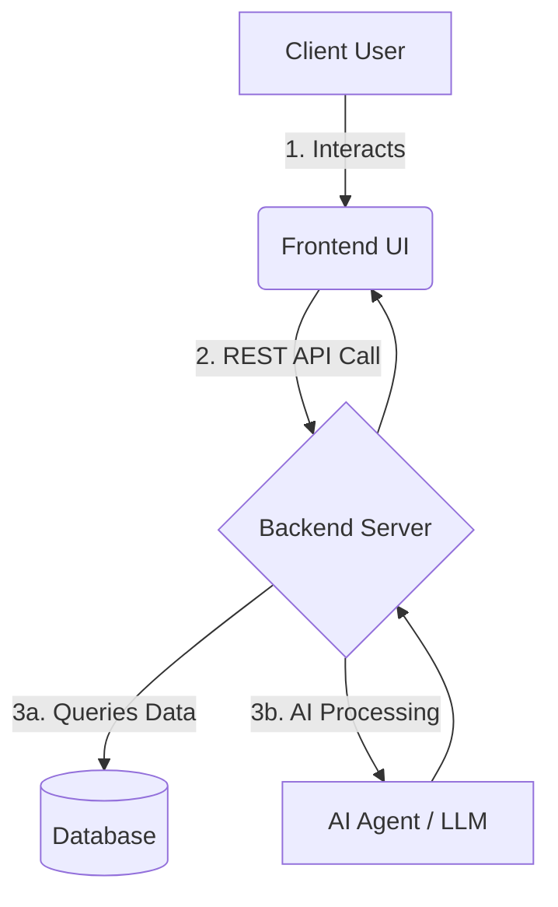

# Product Requirements Document (PRD): [Project Name Here]

## 1. Overview
[Brief description of what this project does and the problem it solves.]

## 2. Architecture Pipeline
The following diagram outlines the relationship between the `front`, `back`, and `ai` components.

## 3. Directory Structure Role
*   **Actionable Items for AI:**
    *   `front/`: Must be pure HTML/JS for GitHub pages preview, or a buildable React snippet.
    *   `back/`: Express/Python API structure.
    *   `ai/`: Core inference logic or LLM prompts.

## 4. Key Features
1. [Feature 1]
2. [Feature 2]

## 5. Development Log / Feedback Notes
*   **[Date]**: Initial PRD creation.
*   **[Feedback]**: [Client feedback from the Workspace dashboard will be summarized here by the AI or Developer]
